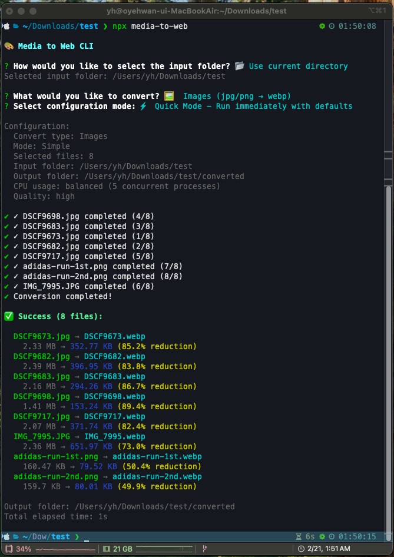

# AI 활용 포트폴리오

## 1. AI를 활용해 해결한 문제 또는 자동화 사례

### TeamButfit WEB Next.js 12 → 15 마이그레이션

#### 문제 상황

- 레거시 코드와 기술 부채가 누적된 프로젝트
- Pages Router → App Router 전환 필요
- styled-components → Tailwind CSS 마이그레이션 필요
- React 18 → 19 업그레이드 필요
- 예상 소요 시간: 일반적인 방식으로 1~2개월

#### AI 활용 방법

**Claude Code + Plan 모드 기반 체계적 마이그레이션**

1. `/add-dir` 명령어로 레거시 프로젝트를 컨텍스트에 연동
2. Plan 모드에서 마이그레이션 계획 수립 및 반복 수정
3. 계획 승인 후 페이지/컴포넌트 단위로 구현 진행
4. AI가 코드 변환 담당, 본인이 동작 검증 수행

```
워크플로:
[Plan 모드] 계획 수립 → 사용자 검토 → 계획 수정 → 승인 → [구현] 코드 생성 → 동작 검증 → 반복
```

#### 기여도

`아키텍처 설계 20% + AI 80%, 코드 변환 AI 100%, 동작 검증(수동) 100%`

#### 개선 결과

| 지표               | Before       | After    | 개선율         |
| ------------------ | ------------ | -------- | -------------- |
| 프로덕션 빌드 시간 | 28.75초      | 8.64초   | **3.3배 단축** |
| JS 번들 크기       | 33MB         | 1.8MB    | **94.5% 감소** |
| 런타임 의존성      | 57개         | 15개     | **73.7% 감소** |
| 소스 코드량        | 47,280줄     | 28,137줄 | **40.5% 감소** |
| **소요 기간**      | 예상 1~2개월 | **2주**  | **75% 단축**   |

---

## 2. AI를 개발 워크플로에 통합한 사례

### CLAUDE.md + Agent Skills 기반 AI 협업 개발 환경

#### 구조

프로젝트별로 AI와의 협업 규칙을 정의하여 일관된 개발 환경을 구축했습니다.

```
프로젝트/
├── .claude/
│   └── feature-implementer/        # 개인 스킬 (외부에서 가져옴)
│       ├── SKILL_KO.md             # Phase별 실행 스킬
│       └── change-summary-template_KO.md  # 변경 추적 템플릿
└── CLAUDE.md                       # 팀 공용 AI 협업 규칙
```

#### 팀 공용 CLAUDE.md 주요 내용

```markdown
## 중요 지침

- 모든 출력과 문서는 한글로 작성합니다.
- 코드를 생성하고 수정할 때는 ../shared/pr.md 파일을 참고하여 코드 스타일 가이드를 따라주세요.
- 코드는 항상 Best Practice를 따라 작성합니다.
- 항상 제안을 먼저 하고, 이후 사용자가 선택하게 해주세요. 바로 실행하지 말고 사용자의 확인을 받으세요.

## 프로젝트 개요

[프로젝트 설명, 기술 스택, 디렉토리 구조]

## QA 규칙

- 출력 형식: Markdown 테이블, Notion 호환 형식
- 카테고리: Functional, Boundary, Security, Error Handling, Integration
- 우선순위: Critical, High, Medium, Low
```

#### 개인 스킬 활용

**1. Vercel react-best-practice 스킬**

- React 코드 품질 가이드라인 자동 적용

**2. feature-implementer 스킬 (코드팩토리 제공)**

- Phase별 단계 실행 및 사용자 승인
- Quality Gate 자동 검증 (빌드, 테스트, 린트)
- 변경 사항 추적 및 위험 평가
- Git 커밋 자동화

**3. 기술 스택별 스킬 활용**

- 백엔드 개발 등 익숙하지 않은 영역에서는 Skill Agent, Marketplace에서 해당 기술 스택에 맞는 스킬을 찾아 설치하여 활용
- 예: NestJS, Docker, AWS 관련 스킬 등

#### Plan 모드 활용 방식

```
[1단계] 상황 파악 - 현재 문제점, 요구사항 정리
[2단계] 계획 수립 - 구체적인 작업 목록 생성
[3단계] 계획 수정 (반복) - 사용자 피드백 반영
[4단계] 승인 후 구현 - 계획에 따라 순차적 구현
```

#### 기여도

`워크플로 설계 100%, CLAUDE.md 설계 100% + AI 작성 보조, 스킬 선택/적용 100%`

#### 효과

- **일관성**: AI가 프로젝트 컨텍스트를 이해하고 팀 컨벤션 준수
- **효율성**: "제안 → 확인 → 실행" 원칙으로 불필요한 수정 감소
- **품질**: QA 시나리오 자동 생성, Quality Gate 자동 검증

---

## 3. AI의 한계를 겪고 해결한 경험

### styled-components → Tailwind CSS 마이그레이션 중 할루시네이션 문제

#### 문제 상황

Next.js 마이그레이션 과정에서 styled-components로 작성된 UI를 Tailwind CSS로 변환하는 작업을 진행했습니다.

**초기 접근 (실패)**

- 페이지 단위로 전체 UI 마이그레이션 요청
- AI가 레거시 UI와 다른 형태의 UI를 생성 (할루시네이션)
- 레이아웃 구조, 스타일링이 원본과 불일치

```
# 실패한 프롬프트 예시
"이 페이지의 styled-components를 Tailwind CSS로 변환해줘"
→ AI가 원본과 다른 UI 구조를 임의로 생성
```

#### 문제 분석

1. **컨텍스트 과부하**: 페이지 전체를 한 번에 처리하려니 AI가 세부 사항을 놓침
2. **명시적 참조 부족**: 레거시 코드의 어떤 부분을 변환해야 하는지 불명확
3. **검증 어려움**: 큰 단위의 변경은 어디서 잘못됐는지 파악하기 어려움

#### 해결 과정

**1단계: 기능 체크리스트 작성**

```markdown
## 회원 목록 페이지 기능

- [ ] 상단 검색 필터 (이름, 전화번호, 멤버십)
- [ ] 회원 테이블 (정렬, 페이지네이션)
- [ ] 회원 상세 모달
- [ ] 일괄 작업 버튼
```

**2단계: 레이아웃 우선 구현**

```
1. 먼저 페이지의 전체 레이아웃 구조만 잡기
2. 빈 컴포넌트 자리 표시
3. 레이아웃 검증 후 다음 단계 진행
```

**3단계: 컴포넌트 단위 마이그레이션**

```
# 개선된 프롬프트 예시
"레거시 프로젝트의 MemberSearchFilter 컴포넌트를 확인하고,
동일한 UI와 기능을 Tailwind CSS로 구현해줘.
레거시 파일 위치: src/components/member/MemberSearchFilter.tsx"
→ AI가 명시된 파일을 참조하여 정확한 변환 수행
```

**4단계: 할루시네이션 발생 시 대응**

- 레거시 컴포넌트 파일 경로 명시적 지정
- "이 파일의 UI를 그대로 유지하면서 변환" 지시
- 스크린샷 비교 검증

#### 기여도

`문제 발견 100%, 해결책 설계 100%, 코드 구현 AI 100%`

#### 결과 및 교훈

**정량적 결과**

- 할루시네이션 발생률: 초기 40~50% → 개선 후 5% 미만
- 재작업 횟수: 페이지당 평균 5회 → 1회 이하

**핵심 교훈**

```
1. 작업 단위는 작을수록 좋다
   페이지 단위 ❌ → 컴포넌트 단위 ✅

2. 명시적 참조가 필수
   "이 페이지 변환해줘" ❌ → "이 파일(경로)을 참조해서 변환해줘" ✅

3. 검증 가능한 단위로 분할
   전체 한번에 검증 ❌ → 단계별 검증 ✅
```

---

## 4. AI를 활용한 프로토타입 제작 사례

### media-to-web CLI 오픈소스 도구 개발

#### 개발 배경

이미지와 비디오를 웹 최적화 형식(WebP, WebM)으로 변환하는 작업을 반복적으로 수행하면서, 파일을 하나씩 변환 프로그램에서 처리하는 번거로움을 느꼈습니다.

#### 개발 기간

**1일 미만** (Claude Code 활용)

#### 기여도

`요구사항 정의 100%, 설계/구현/문서화 AI 100%`

#### 프롬프트 예시

```
## 초기 요구사항 프롬프트
"이미지와 비디오를 웹 최적화 형식으로 변환하는 CLI 도구를 만들고 싶어.
- JPG/PNG → WebP
- MP4/MOV → WebM
- 폴더 단위 일괄 변환
- 진행 상황 표시"

## 기능 추가 프롬프트
"GPU 가속을 지원하도록 해줘. NVIDIA와 AMD GPU를 자동 감지해서
가능하면 하드웨어 인코딩을 사용하도록."

## 개선 프롬프트
"변환 속도를 높이기 위해 병렬 처리를 추가해줘.
CPU 코어 수에 맞춰 동시에 여러 파일을 처리하도록."
```

#### 구현된 기능

- 이미지 변환 (JPG/PNG → WebP)
- 비디오 변환 (MP4/MOV → WebM)
- GPU 가속 (NVIDIA/AMD 자동 감지)
- 병렬 처리 (2~4배 빠른 변환)
- 인터랙티브 폴더 브라우저
- 진행률 표시
- 품질 옵션 설정

#### 프로젝트 구조

```
media-to-web/
├── bin/                    # CLI 진입점
│   └── index.ts
├── src/
│   ├── config/             # 설정 (이미지/비디오 변환 옵션, 타입)
│   ├── converters/         # 변환기 (Base, Image, Video, Factory)
│   ├── prompts/            # 대화형 프롬프트 (모드, 파일선택, 품질 등)
│   ├── types/              # 타입 정의
│   └── utils/              # 유틸리티 (파일, GPU)
├── tests/
│   ├── e2e/                # E2E 테스트
│   └── fixtures/           # 테스트 픽스처 (mp4, png)
├── scripts/                # 스크립트
├── package.json
├── tsconfig.json
├── README.md / README.ko.md
├── CHANGELOG.md
└── LICENSE
```

#### 실행 화면



> npx를 통해 설치 없이 바로 실행 가능

#### 결과

- **GitHub Repository**: [github.com/dioKR/media-to-web](https://github.com/dioKR/media-to-web)
- **개발 소요 시간**: 1일 미만
- **실사용**: 개인 프로젝트 및 회사 업무에서 활용 중
